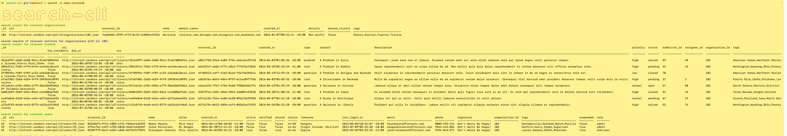

# Search CLI

[](https://travis-ci.org/joemccann/dillinger)

Search CLI is a simple search cli tool which makes searching in the given dataset at ease



## Features

  - Case insensitive search for any field of organization, user, ticket entity
  - Return all relavent entities ( i.e. searching user by name should return all its relavent tickets and organizations.)
  - Search empty field ( i.e. can search even where field is empty.)
  - Display error when invalid field or value is provided

## Trade-off  
  - Extra space and time are required in order to convert array of objects into map
  - But map will reduce the time for searching from O(n) to O(log(n))
  - Can dramatically improve performance when the size of data grows

## Installation

Search CLI requires [Node.js](https://nodejs.org/) v8.12.0+ to run.

Install the dependencies and devDependencies and start the cli.

```sh
$ cd search-cli
$ npm run create
```

For testing

```sh
$ cd search-cli
$ npm run create
$ npm run unit-test
```  
  
## Usage Examples

 - Check the version of this search cli
  ```sh
$ search -V
```
  - Look for help for usages
  ```sh
$ search -h
```

  - Search organization by any field, and return all relavent tickets and users
  ```sh
$ search -o domain_names,'trollery.com'
$ search -o name,'nutralab‘  
$ search --organizations _id,112  
```

  - Search tickets by any field, and return all relavent organizations and users
  ```sh
$ search -t subject,'a problem in gambia'
$ search -t _id,20615fe1-765b-4ff5-b4f6-ea42dcc8cac3  
$ search --tickets has_incidents,false  
```

 - Search users by any field, and return all relavent organizations and tickets
 ```sh
$ search -u name,'roman meyers'
$ search -u _id,26
$ search --users verified,false  
```

## Dependency

Search CLI uses a number of open source projects to work properly:

* [Commander](https://www.npmjs.com/package/commander)
* [figlet](https://www.npmjs.com/package/figletr)
* [chalk](https://www.npmjs.com/package/chalk)
* [Jest](https://www.npmjs.com/package/jest)
* [Typescript](https://github.com/microsoft/TypeScript)
* [node.js]()

## Release History
* 0.0.1
    * Basic search funcions implemented

## Todos

 - Integration test

License
----
ISC


